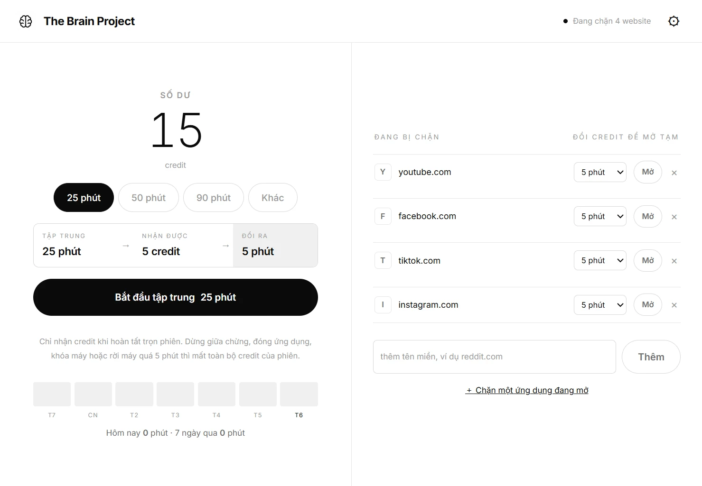
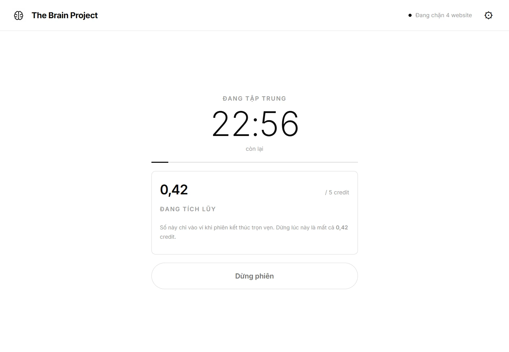
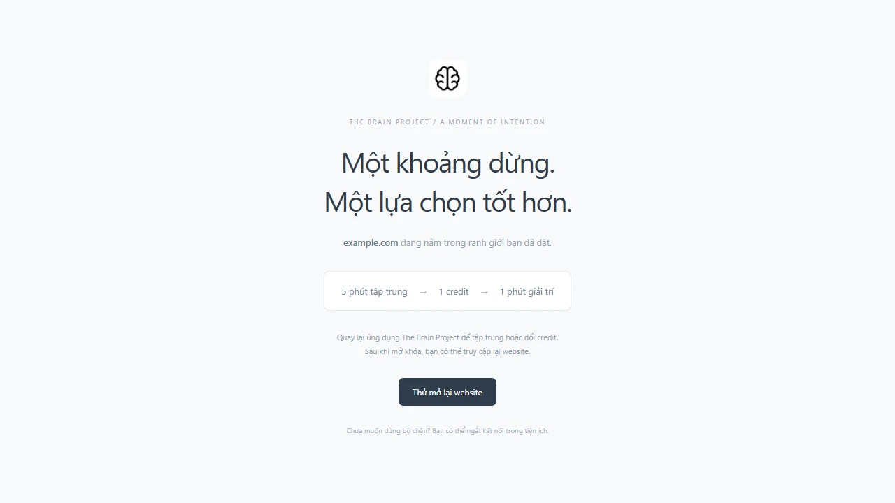
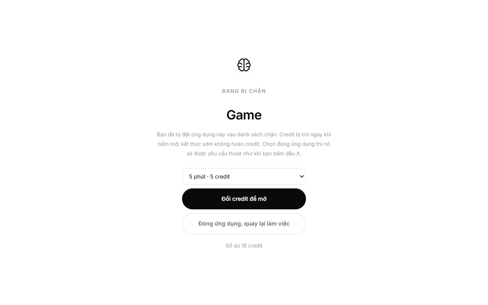
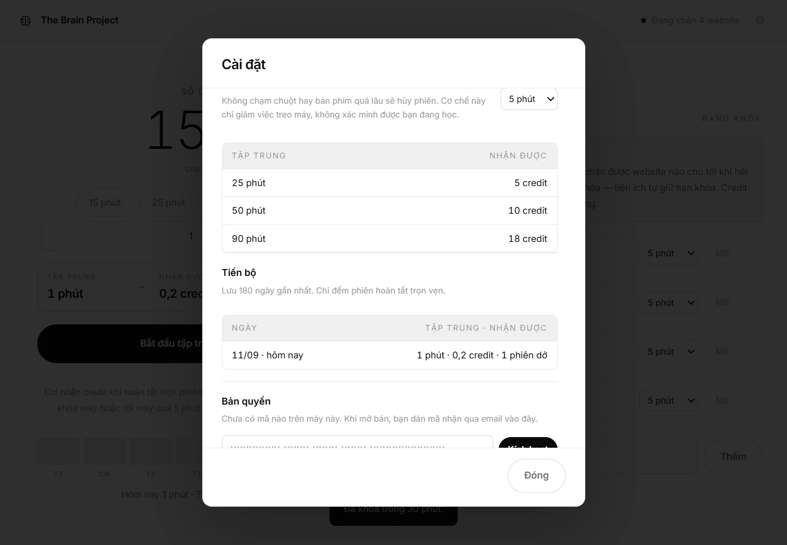

# The Brain Project

Một vòng lặp duy nhất: **tập trung để kiếm credit, đổi credit để mở website gây nghiện.**

Ứng dụng Windows chặn website, ứng dụng và game bạn tự đưa vào danh sách. Muốn mở lại thì phải tự kiếm thời gian: 5 phút tập trung đổi được 1 phút giải trí. Không có nút tắt, không có cách xin thêm.

[**Tải về**](https://github.com/minhnhathoang1003-crypto/The-Brain-Project/releases/latest) · [Trang giới thiệu](https://the-brain-project.vercel.app) · [Có gì mới](CHANGELOG.md)



Giao diện đơn sắc, hai cột: bên trái là nghi thức (số dư, đồng hồ, nút bắt đầu), bên phải là ranh giới (danh sách website bị chặn và nút đổi credit). Cửa sổ hẹp thì hai cột xếp chồng thành một.

| Trong lúc tập trung | Khi mở website bị chặn |
|---|---|
|  |  |
| Hai cột biến mất, cả màn hình chỉ còn một thứ để nhìn. Số credit nhích lên từng giây, và ngay dưới là dòng nhắc bạn sẽ mất đúng chừng đó nếu dừng. | Trang chặn nói cho bạn biết cái giá thay vì chỉ báo lỗi. |

| Khi mở ứng dụng bị chặn | Chế độ khóa |
|---|---|
|  |  |
| Lớp phủ che kín ứng dụng đó. Không tiến trình nào bị giết nên bạn không mất dữ liệu đang làm dở. | Khóa cứng, không hủy và không rút ngắn được — kể cả bằng cách xóa dữ liệu. |

## Cài đặt

Tải bản mới nhất ở [trang Releases](https://github.com/minhnhathoang1003-crypto/The-Brain-Project/releases/latest) rồi chạy file `.exe`. Cài ở mức tài khoản người dùng nên không cần quyền quản trị.

Binary chưa ký số, nên Windows SmartScreen sẽ cảnh báo ở lần chạy đầu — chọn *Thông tin khác → Vẫn chạy*.

Từ bản 0.7.0, ứng dụng **tự kiểm tra bản mới** và báo trong ⚙. Nó không tự tải về và không tự cài: bạn bấm thì mới tải, và nó từ chối cài trong lúc bạn đang chạy phiên tập trung hoặc đang trong chế độ khóa.

Chạy từ mã nguồn: `npm.cmd ci` rồi `npm.cmd start`.

## Vòng lặp

Lần cài đầu tiên bạn được tặng **15 credit** để có sẵn thời gian dùng khi cần gấp. Xóa toàn bộ dữ liệu thì số dư về 0, không nhận lại quà.


1. Chọn một mốc thời gian, hoặc “Khác” để nhập số phút tùy ý (1–180). Mặc định có 25 / 50 / 90; đổi các mốc này trong ⚙ → Khung thời gian (giữ từ 1 đến 4 mốc).
2. Dải quy đổi ngay trên nút bắt đầu cho biết trước bạn sẽ nhận gì: **25 phút → 5 credit → 5 phút giải trí**. Tỉ lệ cố định 5 phút tập trung = 1 credit; 1 credit = 1 phút.
3. Trong lúc chạy phiên, credit tích lũy tăng dần theo thời gian thực — kèm dòng nhắc bạn sẽ mất đúng chừng đó nếu dừng.
4. Credit chỉ vào ví khi phiên kết thúc trọn vẹn.

Phiên không được tính nếu bạn dừng giữa chừng, đóng ứng dụng, để máy ngủ, khóa màn hình, đổi đồng hồ hệ thống hoặc không chạm chuột/bàn phím quá ngưỡng không hoạt động (mặc định 5 phút). Ngưỡng này chỉ phát hiện máy đứng yên; nó không chứng minh bạn đang học và không chống được mọi cách giả lập đầu vào.

Mở được nhiều mục cùng lúc — ví dụ mở trình duyệt rồi mở tiếp website bên trong — nhưng mỗi mục trả credit riêng, và không mở lại được mục đang mở. Credit bị trừ ngay khi xác nhận, kể cả khi bạn chưa mở website; kết thúc sớm không hoàn credit. Không tập trung được trong lúc còn thời gian đang mở, và ngược lại. Credit không hết hạn theo ngày.

## Chế độ khóa

Trong ⚙ có thể khóa cứng 30 phút, 1 giờ, 2 giờ hoặc 4 giờ. **Không hủy được, không rút ngắn được.** Trong lúc khóa: không đổi credit, không bỏ chặn website, không xóa dữ liệu, không ngắt tiện ích. Vẫn tập trung và tích credit bình thường.

Tiện ích tự giữ hạn khóa nên tắt ứng dụng hay khởi động lại trình duyệt đều không mở khóa được. Hai thứ vẫn phá được khóa: gỡ tiện ích khỏi trình duyệt, và vặn đồng hồ hệ thống về sau.

## Bộ chặn với tới đâu

Nói thẳng để bạn biết mình đang mua gì:

| | Có chặn | Ghi chú |
|---|---|---|
| Chrome, Edge | ✅ | qua tiện ích; chạy cả khi ứng dụng đã tắt |
| Brave, Vivaldi, Opera | ✅ | cùng nhân Chromium, nạp tiện ích y hệt |
| **Firefox và họ Gecko** | ❌ | Firefox không cho cài tiện ích chưa ký của AMO một cách vĩnh viễn |
| Ứng dụng, game Windows | ✅ | bản Pro; cần ứng dụng đang chạy |
| Điện thoại | ❌ | chưa có |

Mở một trình duyệt ngoài tầm với là đi vòng qua toàn bộ danh sách chặn website. **Ứng dụng nói cho bạn biết ngay lúc đó** thay vì im lặng: khi một trình duyệt như vậy lên tiền cảnh, màn hình chính hiện cảnh báo, và bản Pro chặn được thẳng trình duyệt đó như một ứng dụng ngay từ trong cảnh báo.

## Chạy cùng Windows

Tắt mặc định. Bật trong ⚙ → Ứng dụng. Không bật thì sau mỗi lần khởi động lại máy, phần chặn ứng dụng và lớp phủ không hoạt động cho tới khi bạn tự mở ứng dụng — chặn website thì không ảnh hưởng, vì tiện ích tự giữ danh sách. Khi Windows tự chạy, cửa sổ mở ra ở dạng thu nhỏ.

## Chặn ứng dụng Windows

Nhấn **＋ Chặn một ứng dụng đang mở** ở cột phải và chọn từ danh sách ứng dụng đang chạy. Khi ứng dụng đó lên tiền cảnh, một lớp phủ che nó lại: đổi credit để mở, hoặc **Đóng ứng dụng, quay lại làm việc** — ứng dụng sẽ được yêu cầu thoát như khi bạn bấm dấu X. Nếu nó không chịu thoát (ví dụ đang hỏi lưu file), lớp phủ quay lại sau vài giây.

Không giết tiến trình nào — bạn không mất dữ liệu đang làm dở. Đổi lại, lớp phủ có thể không che được game chạy toàn màn hình độc quyền, và đổi tên file `.exe` là qua mặt được. Cần PowerShell; máy nào chặn PowerShell thì phần chặn ứng dụng đơn giản là không bật, còn chặn website vẫn chạy.

## Tiến bộ

Dải bảy ngày trên màn hình chính, và một cửa sổ Thống kê riêng: chọn 7 / 30 / 90 ngày hoặc toàn bộ, lưới nhịp theo ngày, chuỗi ngày liên tiếp, so sánh với kỳ trước. Chỉ đếm phiên hoàn tất trọn vẹn. Ứng dụng **không xoá lịch sử theo thời gian** — bản Pro xem lại được từ ngày cài, bản Free xem lại 7 ngày gần nhất.

## Danh sách chặn

Website nằm trong danh sách là bị chặn — không có công tắc bật/tắt. Muốn bỏ chặn thì xóa khỏi danh sách. Mặc định: youtube.com, facebook.com, tiktok.com, instagram.com. Chặn cả tên miền con; `www.` được tự động lược bỏ khi thêm.

## Ghép nối tiện ích

Việc chặn do tiện ích Chrome / Edge thực hiện. Lần chạy đầu, app dừng ở màn hình hướng dẫn và không cho vào màn hình chính — vì chưa ghép nối thì credit không có tác dụng gì.

**Tiện ích đã có trên [Chrome Web Store](https://chromewebstore.google.com/detail/coiphhfihfbpecbbmlacejgjbcgikhhn)**, nên cài chỉ còn hai bước:

1. Nhấn **Cài tiện ích** → **Add to Chrome**.
2. **Sao chép mã ghép nối**, dán vào popup tiện ích rồi kết nối.

Link cửa hàng nằm ở hai chỗ vì app và website không đọc được file của nhau: `EXTENSION_URL` trong `src/main.cjs` và `extensionUrl` trong `website/config.js`. `npm.cmd run test:site:install` canh hai bản sao đó bằng nhau. Để trống cả hai thì quay về hướng dẫn nạp thủ công — không bao giờ hiện một nút trỏ vào chỗ chưa chắc có:

1. Nhấn **Mở thư mục tiện ích**.
2. Vào `chrome://extensions` (Edge: `edge://extensions`).
3. Bật **Developer mode** → **Load unpacked** → chọn thư mục vừa mở.
4. **Sao chép mã ghép nối**, dán vào popup tiện ích rồi kết nối.

Cách thủ công vẫn cần khi chạy từ mã nguồn, nên nó không bị bỏ đi — chỉ gập lại.

**Phiên bản tiện ích.** Tiện ích tự khai phiên bản khi ghép nối, và ⚙ → Bộ chặn hiện nó ra. Cần bản **0.7.0** trở lên: bản cũ hơn vẫn chặn đúng và vẫn giữ hạn chế độ khóa, chỉ là màn hình chặn chưa đổi credit được tại chỗ. Cài từ cửa hàng thì Chrome tự cập nhật.

Đóng gói bản mới để nộp cửa hàng: `npm.cmd run extzip` — script tăng-phiên-bản-mới-cho-qua, và đối chiếu từng font mà `blocked.css` gọi với thứ thật sự nằm trong ZIP.

Chỉ phải làm một lần. Mã ghép nối được giữ lại, nên các lần mở ứng dụng sau tiện ích tự kết nối lại sau khoảng hai giây — không phải ghép nối lại.

Xong bước 4, màn hình tự chuyển tiếp. Nếu sau này tiện ích rớt kết nối, app không nhốt bạn lại — chỉ báo rõ "Chưa chặn được website nào" ở thanh trên và chặn việc đổi credit.

Website bị chặn cả ngoài phiên tập trung. Hết thời gian mở, tab đang mở cũng bị chuyển về trang chặn. Khi ứng dụng mất kết nối, tiện ích giữ danh sách chặn và thu hồi quyền mở tạm. Tiện ích đọc URL tab để áp dụng luật nhưng không gửi lịch sử duyệt web về ứng dụng. Chưa tách riêng Shorts trong YouTube và chưa chặn trên điện thoại.

## Giao diện

Đơn sắc, chỉ đen trắng và các mức xám. Ba lựa chọn trong ⚙: **Theo hệ thống** (mặc định, đi theo cài đặt sáng/tối của Windows), **Sáng**, **Tối**. Lựa chọn được lưu cùng dữ liệu.

## Dữ liệu

Lưu trên máy, mã hóa bằng safeStorage theo tài khoản Windows. Ứng dụng chỉ giữ: mã ghép nối, số dư credit, lịch sử theo ngày, danh sách website và ứng dụng bị chặn, chủ đề giao diện, khung thời gian, ngưỡng không hoạt động, hạn chế độ khóa, phiên đang chạy và các lượt mở đang chạy.

Dữ liệu của mọi bản cũ được nâng lên phiên bản hiện tại khi mở bản này: giữ mã ghép nối (không phải ghép lại), số dư, ngưỡng không hoạt động, website đang bật và lượt mở còn hiệu lực; hoàn phần thời gian chưa dùng của những lượt mở không còn hỗ trợ đúng một lần. Task, thói quen, lịch sử phiên, sổ credit và câu hỏi nhìn lại **không** được chuyển sang. Trước khi chuyển, ứng dụng lưu bản sao mã hóa `brain-data.enc.backup`; nút xóa toàn bộ dữ liệu sẽ xóa cả bản sao này.

Khóa mã hóa nằm trong file `Local State` cùng thư mục dữ liệu, nên muốn sao lưu thì phải chép **cả thư mục** `%APPDATA%	he-brain-project`, không chép riêng `brain-data.enc`.

Không có xuất JSON và không đồng bộ. Ứng dụng **có** tự kiểm tra bản mới (từ 0.7.0) nhưng không tự tải và không tự cài — xem mục Cài đặt ở trên.

## Kiểm thử

```bash
npm.cmd test && npm.cmd run test:ui && npm.cmd run test:migrate && npm.cmd run test:appblock && npm.cmd run test:flows && npm.cmd run test:restart && npm.cmd run test:browser
```

`test` là engine + luật của tiện ích. `test:ui` chạy Electron thật, gồm một phiên 60 giây thật nên mất khoảng hai phút. `test:migrate` kiểm tra nâng cấp dữ liệu cũ và bố cục ở hai kích thước cửa sổ. `test:restart` kiểm tra việc mở lại ứng dụng không cần ghép nối lại. `test:appblock` kiểm chặn ứng dụng Windows. `test:browser` nạp tiện ích vào Chromium thật (không có thì dùng Edge với profile tạm). Sau `npm.cmd run build`, chạy thêm `node tests/packaged.cjs`.
